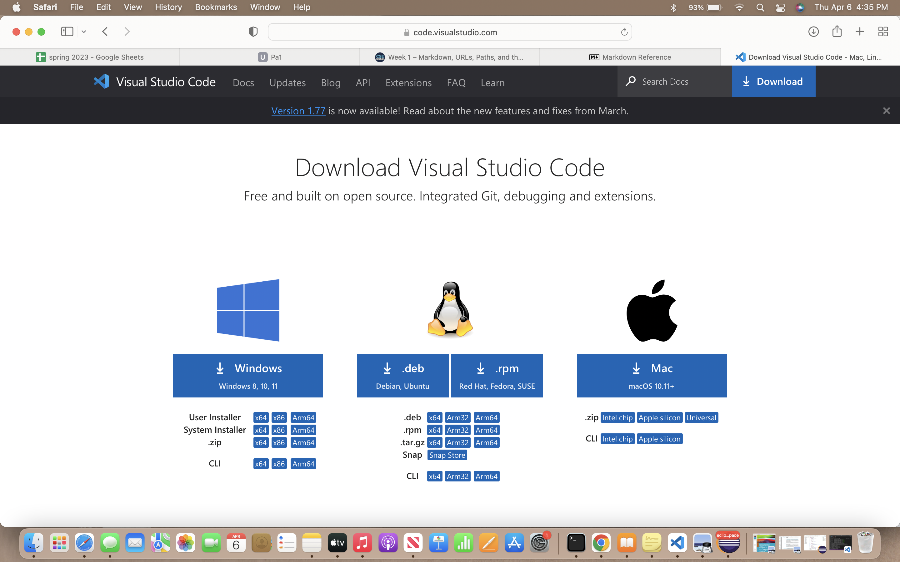

# **Lab Report 1: Remote Access and FileSystem**
---------

## **Step One: Installing VScode** 
To download VScode, open this [link](https://code.visualstudio.com). You will see this screen: 

The next step is to click on the "download" button on the top right. Once you do that, you will see this. 

From here, click on one of the following, depending on your type and model of your computer/laptop. 
## Step Two: Remotely Connecting 

## Step Three:Trying Some Commands 
